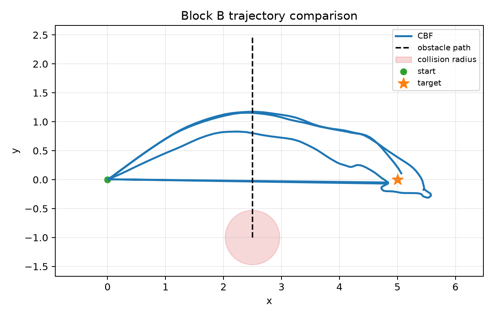
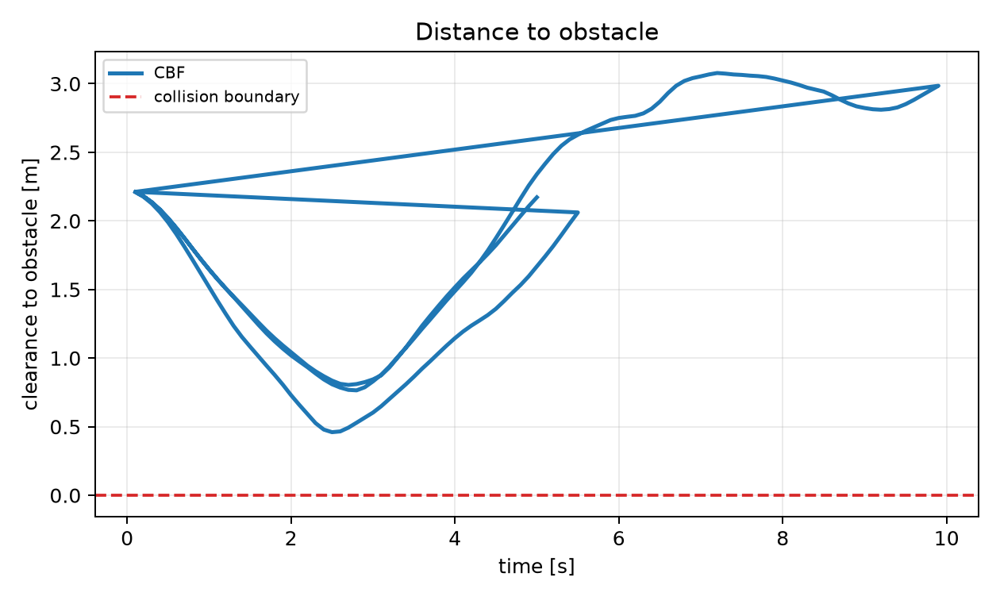
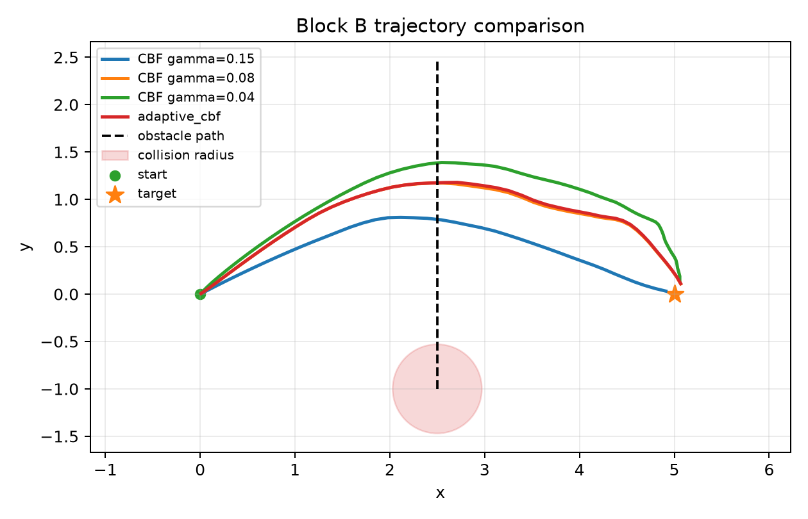
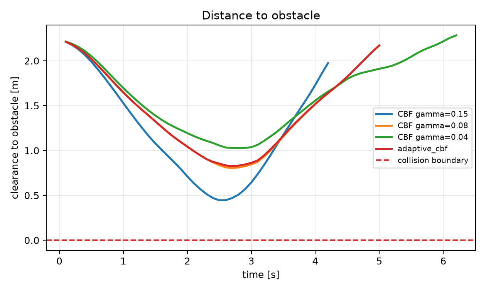

# Adaptive CBF-MPC Dynamic Obstacle Safety

## Goal

This repository contains reproducible non-LLM adaptive safety baselines for MPC-CBF dynamic obstacle avoidance.

It is Block B of the larger LaMPC-CBF reference micro-experiment workspace.

Block B focuses on:

```text
E5 -> E6
```

The goal is to create a strong rule-based and estimation-aware comparator before testing language/LLM interfaces.

## Research Role

Block B answers the adaptive-safety foundation question:

```text
Can non-LLM obstacle prediction and rule-based gamma adaptation already
improve MPC-CBF safety enough to challenge language-guided online tuning?
```

This block is required before claiming that language/LLM feedback is necessary.

## Experiments

| ID | Method | Purpose | Expected output |
|---|---|---|---|
| E5 | Dynamic obstacle prediction comparison | Compare static-horizon assumption, stale sensing, and velocity prediction | Safety under dynamic obstacle uncertainty |
| E6 | Rule-based adaptive gamma | Compare fixed gamma vs distance/TTC-based gamma updates | Strong non-LLM adaptive CBF baseline |

## References Needed For This Block

These references come from:

```text
/home/otismcleary/Documents/paper/Safety-Aware_Optimal_Control_With_Language-Guided_Online_Parameter_Adjustment_via_Large_Language_Models.pdf
```

Local reading corpus:

```text
papers/manifest.md
```

PDF files in `papers/` are stored locally for reading and ignored by Git. The manifest records source URLs, local filenames, and checksum values.

Required references:

| Ref | Paper | Used by | Why needed |
|---|---|---|---|
| [5] | Jian et al., "Dynamic control barrier function-based model predictive control to safety-critical obstacle-avoidance of mobile robot," 2023 | E5 | Dynamic obstacle estimation and prediction for CBF-MPC. |
| [9] | Kim, Kee, and Panagou, "Learning to refine input constrained control barrier functions via uncertainty-aware online parameter adaptation," 2024 | E6 | Online adaptation of CBF parameters. |
| [10] | Zhang et al., "Online efficient safety-critical control for mobile robots in unknown dynamic multi-obstacle environments," 2024 | E5, E6 | Online safety-critical control in dynamic obstacle environments. |
| [11] | Parwana, Mustafa, and Panagou, "Trust-based rate-tunable control barrier functions for non-cooperative multi-agent systems," 2022 | E6 | Rate-tunable CBF motivation for rule-based gamma adaptation. |

References deferred to other blocks:

| Ref | Block | Reason |
|---|---|---|
| [2], [3], [4], [47], [48], [51], [52] | Block A | Core fixed MPC/MPC-CBF baselines. |
| [31], [32], [38] | Block C/D | Language-to-MPC and language-guided MPC baselines. |
| [39]-[44] | Block C | Language trajectory correction/editing. |
| [55], [56] | Block E | Language-behavior alignment metrics. |

## Shared Scenario

```text
Robot: point-mass 2D
Task: move from start to target
Obstacle: dynamic circle crossing the direct path
Seeds: 10 for smoke/dev runs, 50 for paper-level results
```

## Repository Structure

```text
configs/   scenario and experiment configs
docs/      experiment protocol, reports, and log
results/   generated summaries, traces, and plots
scripts/   runner entrypoints
src/       shared implementation
```

## Quickstart

Install minimal dependencies:

```bash
python3 -m pip install -r requirements.txt
```

Run the smoke/dev benchmark:

```bash
bash scripts/run_block_b_smoke.sh
```

Run individual paper-scale experiments:

```bash
python3 scripts/run_e5_dynamic_obstacle_prediction.py --seeds 50 --gamma 0.08 --sensor-delay-steps 3 --output results/paper_main/e5_prediction_50_seed
python3 scripts/run_e6_rule_adaptive_gamma.py --seeds 50 --fixed-gammas 0.15 0.08 0.04 --output results/paper_main/e6_adaptive_50_seed
```

Run the complete reproducible suite:

```bash
bash scripts/reproduce_all.sh
```

Generated outputs are written under `results/` and are ignored by Git except selected tables and figures copied into `docs/`.

## Standard Result Layout

Each experiment writes the same machine-readable layout for later LaMPC/LLM blocks:

```text
results/
  experiment_name/
    config.yaml
    metrics_summary.csv
    per_seed_metrics.csv
    trajectories/
      seed_000_cbf_gamma_0.08.csv
      seed_000_adaptive_cbf.csv
    figures/
      seed_000_overlay.png
      seed_000_clearance_curve.png
      clearance_boxplot.png
      solve_time_boxplot.png
    logs/
      run.log
    report.md
```

`per_seed_metrics.csv` uses the fixed schema:

```text
experiment,scenario,controller,backend,seed,gamma,success,collision,min_clearance,path_length,completion_time,mean_solve_time,p95_solve_time,solver_failures,infeasible_rate,fallback_rate,collision_after_fallback,control_failure
```

## Solver Backends

Block B supports both backends:

| Backend | Purpose |
|---|---|
| `random_shooting` | Fast reproducible micro-experiment backend used for 50-seed paper sweeps. |
| `casadi` | CasADi/IPOPT MPC-CBF backend synced from Block A for solver-level comparison. |

Use `--backend casadi --casadi-horizon 8` on E5/E6 scripts to run the CasADi/IPOPT backend.

## Paper-Scale Results

Last local run: 2026-07-08.

Full generated tables:

```text
docs/tables/summary_metrics.md
docs/tables/scenario_comparison.md
docs/tables/paired_delta.md
docs/paper_section_results.md
```

### E5: Dynamic Obstacle Prediction, 50 Seeds

| Method | Success | Collision | Infeasible | Clearance | Path | Time | Solve |
|---|---:|---:|---:|---:|---:|---:|---:|
| CBF static obstacle in horizon | 0.880 | 0.000 | 0.073 | 0.506 m | 5.703 m | 5.97 s | 1.834 ms |
| CBF stale sensing delay=3 | 0.800 | 0.000 | 0.033 | 0.775 m | 5.985 m | 6.29 s | 1.845 ms |
| CBF velocity prediction | 0.860 | 0.000 | 0.026 | 0.823 m | 5.970 m | 6.05 s | 1.826 ms |

### E6: Fixed Gamma vs Rule-Adaptive CBF, 50 Seeds

| Method | Success | Collision | Infeasible | Clearance | Path | Time | Solve |
|---|---:|---:|---:|---:|---:|---:|---:|
| Fixed CBF gamma=0.15 | 0.880 | 0.000 | 0.016 | 0.491 m | 5.600 m | 5.72 s | 1.838 ms |
| Fixed CBF gamma=0.08 | 0.860 | 0.000 | 0.026 | 0.823 m | 5.970 m | 6.05 s | 1.832 ms |
| Fixed CBF gamma=0.04 | 0.860 | 0.000 | 0.315 | 1.033 m | 6.394 m | 6.66 s | 1.827 ms |
| Rule adaptive CBF | 0.800 | 0.000 | 0.040 | 0.853 m | 6.140 m | 6.66 s | 1.822 ms |

Current interpretation:

- E5 shows dynamic velocity prediction increases mean clearance over the static obstacle assumption, with no collisions in the current scenario.
- E6 shows the rule-adaptive CBF is close to fixed `gamma=0.08` on clearance, but loses task-completion rate in the base scenario.
- Fixed `gamma=0.04` is the most conservative baseline by clearance, but has much higher infeasible-rate and longer paths.
- This gives future language-guided methods a concrete target: improve clearance without the success loss seen in the hand-coded adaptive rule.

### E6 Per-Scenario Table

| Scenario | Method | Seeds | Success | Collision | Clearance | Path | Time | Solve |
|---|---|---:|---:|---:|---:|---:|---:|---:|
| aggressive_crossing_v1 | Fixed CBF gamma=0.15 | 50 | 1.00 | 0.00 | 0.309 | 5.467 | 4.37 | 1.326 |
| aggressive_crossing_v1 | Fixed CBF gamma=0.08 | 50 | 1.00 | 0.00 | 0.416 | 5.747 | 4.56 | 1.324 |
| aggressive_crossing_v1 | Fixed CBF gamma=0.04 | 50 | 1.00 | 0.00 | 0.483 | 5.803 | 4.61 | 1.324 |
| aggressive_crossing_v1 | Rule adaptive CBF | 50 | 1.00 | 0.00 | 0.475 | 5.815 | 4.61 | 1.328 |
| fast_crossing_v1 | Fixed CBF gamma=0.15 | 50 | 1.00 | 0.00 | 0.266 | 5.634 | 4.48 | 1.316 |
| fast_crossing_v1 | Fixed CBF gamma=0.08 | 50 | 1.00 | 0.00 | 0.324 | 5.759 | 4.60 | 1.321 |
| fast_crossing_v1 | Fixed CBF gamma=0.04 | 50 | 1.00 | 0.00 | 0.360 | 5.812 | 4.64 | 1.318 |
| fast_crossing_v1 | Rule adaptive CBF | 50 | 1.00 | 0.00 | 0.353 | 5.809 | 4.63 | 1.323 |
| head_on_v1 | Fixed CBF gamma=0.15 | 50 | 1.00 | 0.00 | 0.571 | 5.385 | 4.38 | 1.463 |
| head_on_v1 | Fixed CBF gamma=0.08 | 50 | 1.00 | 0.00 | 0.959 | 5.822 | 4.61 | 1.461 |
| head_on_v1 | Fixed CBF gamma=0.04 | 50 | 1.00 | 0.00 | 1.125 | 5.933 | 4.70 | 1.458 |
| head_on_v1 | Rule adaptive CBF | 50 | 1.00 | 0.00 | 1.020 | 5.874 | 4.66 | 1.452 |
| late_crossing_v1 | Fixed CBF gamma=0.15 | 50 | 1.00 | 0.00 | 0.365 | 5.191 | 4.20 | 1.139 |
| late_crossing_v1 | Fixed CBF gamma=0.08 | 50 | 1.00 | 0.00 | 0.739 | 5.802 | 4.61 | 1.147 |
| late_crossing_v1 | Fixed CBF gamma=0.04 | 50 | 1.00 | 0.00 | 0.994 | 6.239 | 4.90 | 1.147 |
| late_crossing_v1 | Rule adaptive CBF | 50 | 1.00 | 0.00 | 0.798 | 5.857 | 4.65 | 1.152 |
| noisy_prediction_v1 | Fixed CBF gamma=0.15 | 50 | 1.00 | 0.00 | 0.438 | 5.234 | 4.32 | 1.492 |
| noisy_prediction_v1 | Fixed CBF gamma=0.08 | 50 | 1.00 | 0.00 | 0.742 | 5.620 | 4.68 | 1.488 |
| noisy_prediction_v1 | Fixed CBF gamma=0.04 | 50 | 1.00 | 0.00 | 0.961 | 5.866 | 4.93 | 1.491 |
| noisy_prediction_v1 | Rule adaptive CBF | 50 | 1.00 | 0.00 | 0.787 | 5.658 | 4.73 | 1.478 |
| point_mass_2d_dynamic_obstacle_v1 | Fixed CBF gamma=0.15 | 50 | 0.88 | 0.00 | 0.491 | 5.600 | 5.72 | 1.838 |
| point_mass_2d_dynamic_obstacle_v1 | Fixed CBF gamma=0.08 | 50 | 0.86 | 0.00 | 0.823 | 5.970 | 6.05 | 1.842 |
| point_mass_2d_dynamic_obstacle_v1 | Fixed CBF gamma=0.04 | 50 | 0.86 | 0.00 | 1.033 | 6.394 | 6.66 | 1.828 |
| point_mass_2d_dynamic_obstacle_v1 | Rule adaptive CBF | 50 | 0.80 | 0.00 | 0.853 | 6.140 | 6.66 | 1.836 |

### E6 Paired Deltas

Deltas are matched by seed and computed as `Rule adaptive CBF - fixed baseline` for the 50-seed paper-main suite.

| Baseline | Seeds | Delta success | Delta collision | Delta clearance | Delta path length | Delta solve time |
|---|---:|---:|---:|---:|---:|---:|
| Fixed CBF gamma=0.15 | 50 | -0.080 +- 0.146 | 0.000 +- 0.000 | 0.362 +- 0.016 | 0.540 +- 0.289 | -0.016 +- 0.010 |
| Fixed CBF gamma=0.08 | 50 | -0.060 +- 0.118 | 0.000 +- 0.000 | 0.030 +- 0.010 | 0.170 +- 0.223 | -0.009 +- 0.008 |
| Fixed CBF gamma=0.04 | 50 | -0.060 +- 0.142 | 0.000 +- 0.000 | -0.181 +- 0.014 | -0.253 +- 0.245 | -0.005 +- 0.008 |

### Backend Comparison

CasADi/IPOPT comparison was run with 20 matched seeds and horizon cap 8.

| Backend | Method | Success | Collision | Infeasible | Fallback | Clearance | Solve |
|---|---|---:|---:|---:|---:|---:|---:|
| random_shooting | Fixed CBF gamma=0.15 | 0.850 | 0.000 | 0.021 | 0.000 | 0.503 | 1.824 ms |
| random_shooting | Fixed CBF gamma=0.08 | 0.850 | 0.000 | 0.033 | 0.000 | 0.838 | 1.827 ms |
| random_shooting | Fixed CBF gamma=0.04 | 0.900 | 0.000 | 0.307 | 0.000 | 1.058 | 1.814 ms |
| random_shooting | Rule adaptive CBF | 0.850 | 0.000 | 0.042 | 0.000 | 0.867 | 1.830 ms |
| casadi | Fixed CBF gamma=0.15 | 1.000 | 0.000 | 0.000 | 0.000 | 0.264 | 5.802 ms |
| casadi | Fixed CBF gamma=0.08 | 1.000 | 0.000 | 0.000 | 0.000 | 0.628 | 5.632 ms |
| casadi | Fixed CBF gamma=0.04 | 1.000 | 0.000 | 0.000 | 0.000 | 1.084 | 5.594 ms |
| casadi | Rule adaptive CBF | 1.000 | 0.000 | 0.256 | 0.258 | 0.475 | 8.542 ms |

## Result Figures

These figures are copied from generated `results/` runs into `docs/figures/` so they render on GitHub.

### E5: Dynamic Obstacle Prediction

Trajectory:


Distance to obstacle:


### E6: Fixed vs Rule-Adaptive Gamma

Trajectory:


Distance to obstacle:


### Paper-Main Figures

E5 paper-main trajectory:



E5 paper-main clearance:



E6 paper-main trajectory:



E6 paper-main clearance:



## Acceptance Criteria

Block B is ready for GitHub/public baseline use when:

- E5 and E6 can run from scripted commands. Done.
- Each experiment writes standardized config, summary, per-seed metrics, trajectory CSVs, figures, logs, and report artifacts. Done.
- E6 compares fixed `gamma=0.15`, `0.08`, `0.04`, and rule-adaptive CBF. Done.
- Backend comparison includes random-shooting and CasADi/IPOPT. Done.
- Per-scenario and paired-delta tables are generated automatically. Done.
- Results can be reproduced without API keys or external LLM services. Done.

## Next Implementation Steps

1. Tune the hard scenarios further if the paper needs explicit collision-rate separation, not only infeasible/safety-margin separation.
2. Use E6 as the strong non-LLM comparator for Block C language interfaces.
3. Keep the artifact schema stable so LaMPC/LLM blocks can consume Block B outputs directly.
