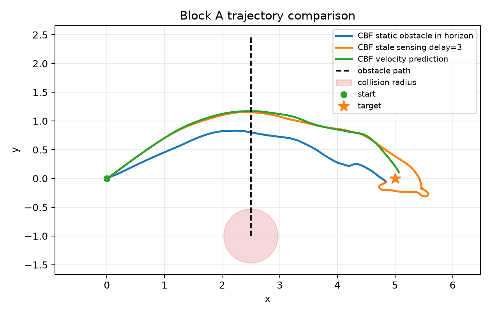
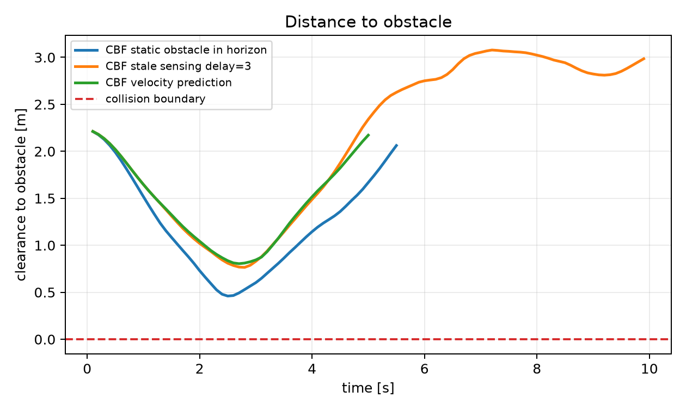
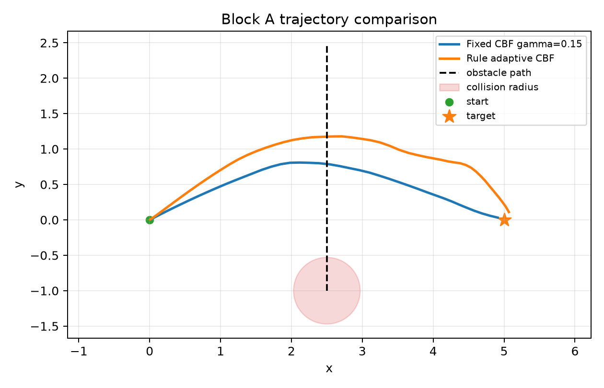
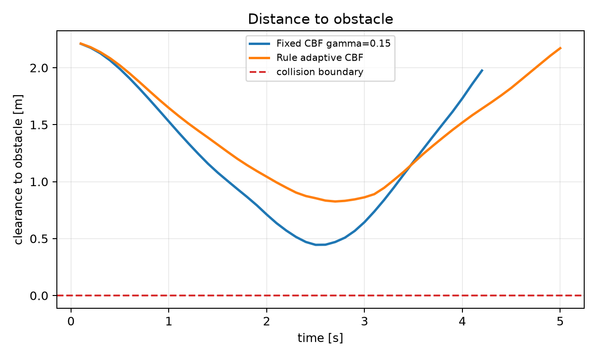

# Adaptive CBF-MPC Dynamic Obstacle Safety

## Goal

This repository contains reproducible non-LLM adaptive safety baselines for MPC-CBF dynamic obstacle avoidance.

It is Block B of the larger LaMPC-CBF reference micro-experiment workspace.

Block B focuses on:

```text
E5 -> E6
```

The goal is to create a strong rule-based and estimation-aware comparator before testing language/LLM interfaces.

## Research Role

Block B answers the adaptive-safety foundation question:

```text
Can non-LLM obstacle prediction and rule-based gamma adaptation already
improve MPC-CBF safety enough to challenge language-guided online tuning?
```

This block is required before claiming that language/LLM feedback is necessary.

## Experiments

| ID | Method | Purpose | Expected output |
|---|---|---|---|
| E5 | Dynamic obstacle prediction comparison | Compare static-horizon assumption, stale sensing, and velocity prediction | Safety under dynamic obstacle uncertainty |
| E6 | Rule-based adaptive gamma | Compare fixed gamma vs distance/TTC-based gamma updates | Strong non-LLM adaptive CBF baseline |

## References Needed For This Block

These references come from:

```text
/home/otismcleary/Documents/paper/Safety-Aware_Optimal_Control_With_Language-Guided_Online_Parameter_Adjustment_via_Large_Language_Models.pdf
```

Local reading corpus:

```text
papers/manifest.md
```

PDF files in `papers/` are stored locally for reading and ignored by Git. The manifest records source URLs, local filenames, and checksum values.

Required references:

| Ref | Paper | Used by | Why needed |
|---|---|---|---|
| [5] | Jian et al., "Dynamic control barrier function-based model predictive control to safety-critical obstacle-avoidance of mobile robot," 2023 | E5 | Dynamic obstacle estimation and prediction for CBF-MPC. |
| [9] | Kim, Kee, and Panagou, "Learning to refine input constrained control barrier functions via uncertainty-aware online parameter adaptation," 2024 | E6 | Online adaptation of CBF parameters. |
| [10] | Zhang et al., "Online efficient safety-critical control for mobile robots in unknown dynamic multi-obstacle environments," 2024 | E5, E6 | Online safety-critical control in dynamic obstacle environments. |
| [11] | Parwana, Mustafa, and Panagou, "Trust-based rate-tunable control barrier functions for non-cooperative multi-agent systems," 2022 | E6 | Rate-tunable CBF motivation for rule-based gamma adaptation. |

References deferred to other blocks:

| Ref | Block | Reason |
|---|---|---|
| [2], [3], [4], [47], [48], [51], [52] | Block A | Core fixed MPC/MPC-CBF baselines. |
| [31], [32], [38] | Block C/D | Language-to-MPC and language-guided MPC baselines. |
| [39]-[44] | Block C | Language trajectory correction/editing. |
| [55], [56] | Block E | Language-behavior alignment metrics. |

## Shared Scenario

```text
Robot: point-mass 2D
Task: move from start to target
Obstacle: dynamic circle crossing the direct path
Seeds: 10 for smoke/dev runs, 50 for paper-level results
```

## Repository Structure

```text
configs/   scenario and experiment configs
docs/      experiment protocol, reports, and log
results/   generated summaries, traces, and plots
scripts/   runner entrypoints
src/       shared implementation
```

## Quickstart

Install minimal dependencies:

```bash
python3 -m pip install -r requirements.txt
```

Run the smoke/dev benchmark:

```bash
bash scripts/run_block_b_smoke.sh
```

Run the 10-seed dev benchmark:

```bash
python3 scripts/run_e5_dynamic_obstacle_prediction.py --seeds 10 --gamma 0.08 --sensor-delay-steps 3
python3 scripts/run_e6_rule_adaptive_gamma.py --seeds 10 --fixed-gamma 0.15
```

Generated outputs are written under `results/exp_e*/` and are ignored by Git.

## Latest Dev Results

Last local run: 2026-07-08, 10 seeds.

Solver implementation:

```text
numpy_random_shooting_mpc
```

Full report:

```text
docs/exp_e5_e6_dev_report.md
```

Summary:

| Experiment | Method | Seeds | Success rate | Collision rate | Mean min clearance | Mean path length | Mean completion time | Mean solve time |
|---|---|---:|---:|---:|---:|---:|---:|---:|
| E5 | CBF static obstacle in horizon | 10 | 0.90 | 0.00 | 0.529 m | 5.564 m | 5.97 s | 1.867 ms |
| E5 | CBF stale sensing, delay=3 | 10 | 0.80 | 0.00 | 0.781 m | 6.080 m | 6.46 s | 1.852 ms |
| E5 | CBF velocity prediction | 10 | 0.90 | 0.00 | 0.812 m | 5.779 m | 5.26 s | 1.829 ms |
| E6 | Fixed CBF gamma=0.15 | 10 | 0.90 | 0.00 | 0.485 m | 5.374 m | 4.85 s | 1.852 ms |
| E6 | Rule adaptive CBF | 10 | 0.80 | 0.00 | 0.856 m | 5.906 m | 6.13 s | 1.853 ms |

Current interpretation:

- E5 shows velocity prediction improves clearance over static horizon modeling while preserving success rate in this dev scenario.
- E6 rule adaptation increases mean clearance from `0.485 m` to `0.856 m`, but reduces success from `0.90` to `0.80`.
- This gives future language-guided methods a strong non-LLM comparator: they should beat the adaptive rule on safety without losing task completion.

## Result Figures

These figures are copied from the latest local `results/exp_e*/` run into `docs/figures/` so they render on GitHub.

### E5: Dynamic Obstacle Prediction

Trajectory:



Distance to obstacle:



### E6: Fixed vs Rule-Adaptive Gamma

Trajectory:



Distance to obstacle:



## Initial Acceptance Criteria

Block B is ready for GitHub/public baseline use when:

- E5 and E6 can run from scripted commands. Done in v1.
- Each experiment writes a config-linked `summary.json`. Done in v1.
- Each experiment records seed, method, scenario, prediction mode, and gamma settings. Done in v1.
- README shows a dev-results table and result figures after the first run. Done in v1.
- Results can be reproduced without API keys or external LLM services.

## Next Implementation Steps

1. Run 50 seeds for paper-level Block B figures.
2. Add a harder dynamic-obstacle scenario if collision-rate separation is needed.
3. Use E6 as the strong non-LLM comparator for Block C language interfaces.
